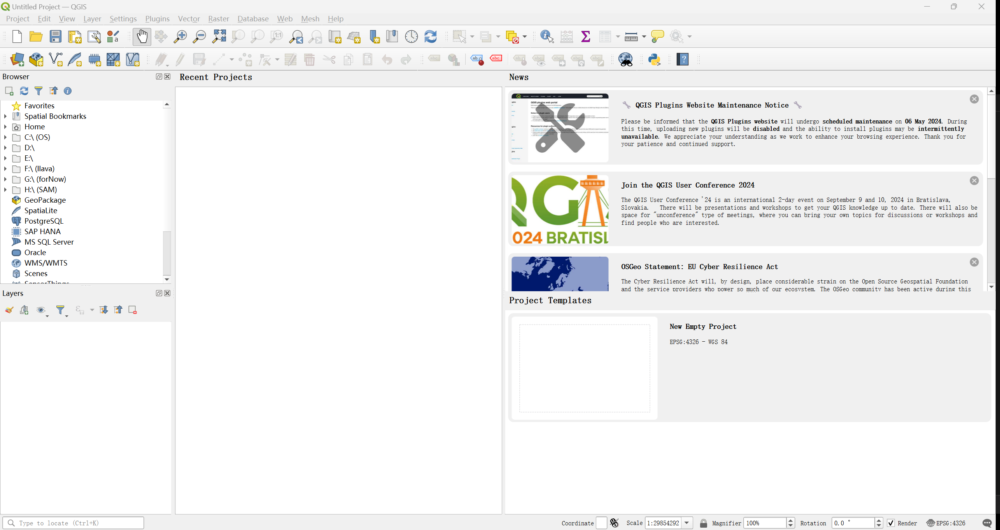
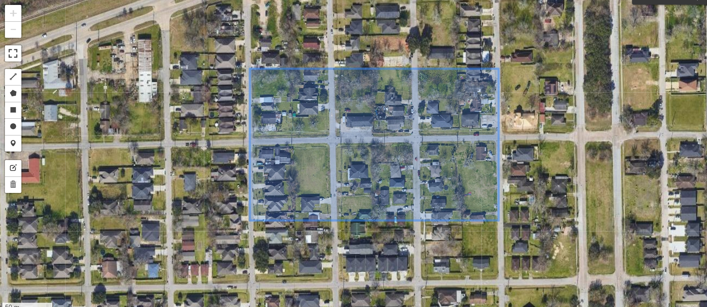
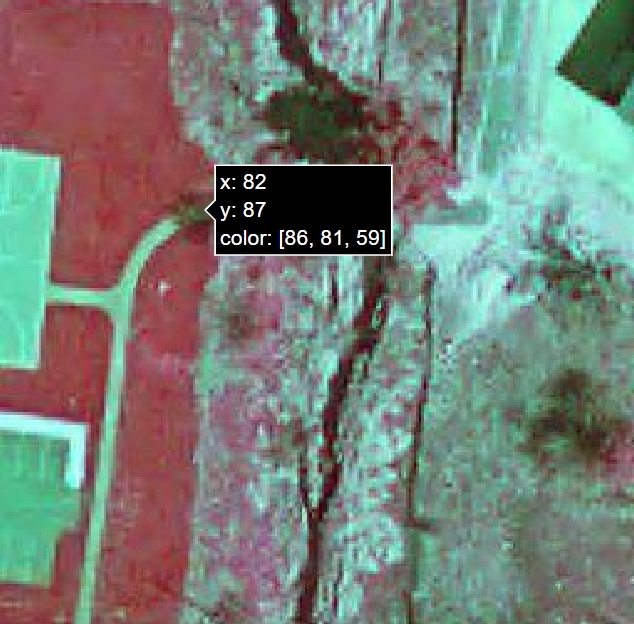
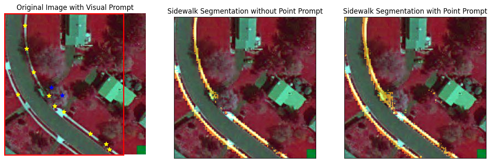
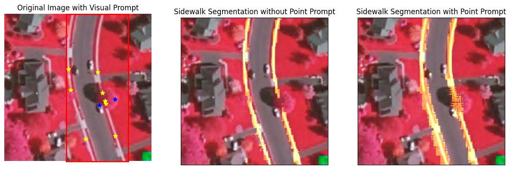
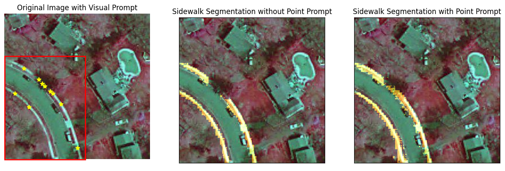
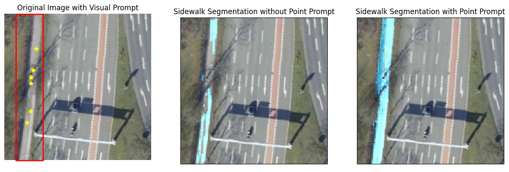

0: Environment setup
--
### 0.1 QGIS Installation
- Download QGIS from [this site](https://qgis.org/en/site/) 
- Click the downloaded `.msi` file and follow the instruction to install QGIS
- When the installation is down, we will have a folder containing such file
- Open `QGIS Desktop 3.36.1`
	- Starting
		
	- The main page
		
## 0.2 Docker container setup
- Download `.devcontainer`, `requirements`  and `docker/Dockerfile.pytorch` from [this repo]( https://github.com/pantelis/artificial-intelligence)
- Set the correct path to the dockerfile in`.devcontainer/devcontainer.json`
- `Ctrl+Shift+P` open control pannel and seaech for `Dev Containers` and start to build

1: SAM implementation for satellite imagery
--
The implementation is showcased in `SAM_for_satellite_imagery.ipynb`
### 1.1 Environment 
- a few packages need to change version for the `samgeo` to work
```	
# change opencv version to 4.8
!pip uninstall opencv-python opencv-contrib-python
!pip install opencv-python==4.8.0.74
!pip install opencv-contrib-python==4.8.0.74

# Install xarray
!pip install xarray

## pyarrow and numpy
!pip install pyarrow==12.0.0
!pip install numpy==1.23
```
- Instal `segment-geospatial`

### 1.2 Load the map
- Create the interactive map and overlay the satellite baseamap
- Select area of interst
	
- Download the image of the iou drawn as ` .tif `and show
	
- Overlay the downloaded image as a new layer of the map
	
### 1.3 SAM segmentation  for satellite imagery
- Load the pretrained SAM model via  `SamGeo(model_type, checkpoint=ckpt,sam_kwargs)`
- Perform SAM segmentation using `sam.generate(image,output=mask)`
- Display and save binary mask `mask.tiff`using `sam.show_masks(cmap="binary_r")`
	
- Display and save annotation image `sam.show_anns(axis="off",alpha=0.7,output="annotation.tif")`
	
- Display the comparision of satellite image and annotation image using `leafmap.image_comparison("satellite.tif", "annotation.tif", label1="Satellite", label2="Image Segmentation")`
	
- Overlay the segmentation result on the interactive map via `m.add_raster("annotation.tif",alpha=0.5,layer_name="Mask")`
	
- Convert the mask to verctor data format e.g., 
	- Geo package `segment.gpkg` via `sam.tiff_to_gpkg(mask, vector, simplify_tolerance=None)`
	- Shapefile `segment.shp` via `sam.tiff_to_vector(mask, shapefile)`
	- Add vector on the interactive map via `m.add_vector(vector, layer_name="Vector", style=style)`
	

2:  Finetune the SAM model for the sidewalks dataset
--
Code for this session is in `Fintune_SAM.ipynb`. 
### 2.1 Environment Setup
- Install the following pacakges/repo
```
!pip install git+https://github.com/facebookresearch/segment-anything.git  # Segment Anything Model
!pip install -q git+https://github.com/huggingface/transformers.git     #Transformers

# Datasets to prepare data and monai if you want to use special loss functions
!pip install datasets
!pip install -q monai

#Patchify to divide large images into smaller patches for training. (Not necessary for smaller images)
!pip install patchify
!pip install tifffile
```

### 2.2 Sidewalk Traning Image Preparation
- Sidewalk data Link in Hugging face: [link](https://huggingface.co/datasets/back2classroom/sidewalks)
- Stream the dataset : Train/Validation
```
from datasets import load_dataset
dataset = load_dataset("back2classroom/sidewalks", split='train', streaming=True)    ##split='train' /'val' 
print(next(iter(dataset)))
```
- Processs the data
	- The keys for each dataset item are : `filename`, `tfw`, `tif`, `label_tif'`, `label_tfw`. The needed information are:
		- `tif`: sidewalk image
		- `label_tif` : correspoding mask
	- Basic image and mask processing:
		- It's important to rescale the pixel value to range [0,1]. That's because the predicted masks in SAM model are probability masks and the ground truth mask will be used to calculate the loss based on the prediction and ground truth
```
for item in stream_dataset:
    image_data = item['tif']
    mask_data = item['label_tif']
    filename = item['filename']
    image = Image.open(io.BytesIO(image_data))   ## Open binary image data
    mask = Image.open(io.BytesIO(mask_data))
    ground_truth_mask = np.array(mask)
    if np.any(ground_truth_mask != 0):
        ground_truth_mask[ground_truth_mask != 0] = 255   ## Turn the mask into binary image
	ground_truth_mask= (ground_truth_mask / 255.).astype(np.uint8)    ## rescale the pxiel values to [0,1]
```
- Prepare the pytorch dataset
	- There are to options to prepare the dataset
		- `SAMDataset(Dataset)` : Option 2 in code
			- Store the streaming data to loacal and inherits PyTorch's `Dataset` class
			- Must include the  ***Basic image and mask processing***  above for each image-mask pair in `__getitem__`
		- `SAMIterableDataset(IterableDataset)`: Option 1 in code
			- Designed to work with iterable datasets like streaming data when the handling large datasets that don't fit into memory entirely
			- Must include the  ***Basic image and mask processing***  above in `__iter__`
	- Both option work depends on resources avaliable and besides the basic image and mask processing the dataset class must include:
		- Get the bounding box of the mask as prompt to same. This is achieved in `get_bounding_box` function
		- Use SAM processor to precess the image and bbox prompt as tensor via for each training batch
		- And final return a dictionary containing` image tensor, prompt tensor, ground truth masks` for each batch in `__iter__` or `__getitem__`
		- Key code
```
prompt = get_bounding_box(ground_truth_mask)
inputs = self.processor(image, input_boxes=[[prompt]], return_tensors="pt")
inputs = {k: v.squeeze(0) for k, v in inputs.items()}
inputs["ground_truth_mask"] = ground_truth_mask
return inputs
```

### 2.2 Fintune SAM with sidewalk dataset
- Load the SAM pretrain model `sam-vit-base`
- Only compute gradients for mask decoder
- Use `DiceCELoss` to compute loss based on the similarity of predicted masks and ground truth masks
- Trained for `3 epcohs`, and the loss for each epoch is as follows and also saved in `fintune_loss.txt`
```
EPOCH: 0
Mean loss: 0.43268537744892716

EPOCH: 1
Mean loss: 0.39350346685764487

EPOCH: 2
Mean loss: 0.3775089961471198
```
- Link to the finetuned model checkpoint : [checkpoint.pth](https://drive.google.com/file/d/14oG9NTEixoisml8vAFJz_1Nf9yX3GJ37/view?usp=sharing)

### 2.3 Inference with the fintuned SAM model in sidewalk images
- Load `sam-vit-base` configration and the fintuned model weight
- Prepare the infernce image and prompt(optional) to process them into tensor to as model input use the same SAM processor
- The inference result on traning samples
	
- The inference result on unseen large `tif` image
	- For a large `.tif` image, we need to patchify the image and use the patches as input separately for tyhe model to perform segmentation
	- Results on a one of the patches
		

3: Visual Prompting for sidewalk occlusion
--
code for this section is in notebook `Sidewalk_visual_prompting.ipynb`
### 3.1  Basics on visual prompting
- ***Whtat's visual prompting?***
	- Visual Prompting is a method in which the user can **label just a few areas of an image** to improve the segmentation accuracy. This is a much faster and easier approach than conventional labeling, which typically requires completely labeling every image in the training set.
- ***Visual prompting in sidewalk occlusion***
	- SAM model has been shown with finetuning to be able to do a reasonable job at segmenting features in remote sensing applications. However without futther fintuning, SAM is possible to handle sidewallk occlusion (e.g., sidewalk being cutoff by trees) with visual prompt
	- By selecting sidewalks inluding parts that's been cut-off by trees, and exclude inrelavent part of the tree, the sidwalk occlusion problem is able to be alleviated.
		
- Use model fintuned on sidewalk images from step 2 and perform visual promting
- According the [docs](https://huggingface.co/docs/transformers/en/model_doc/sam) of SAM model, there are mainly 3 ways to prompt SAM model. All prompts are processed with SAM processor first
	1. Bounding box prompt
		- Input bounding box of area of interest in the format of  `[x_left, y_top,x_right,y_buttom]`
		-  input_boxes : `torch.FloatTensor of shape [batch_size, num_boxes, 4]`
	2. Point prompt
		- Input prompt point of target/unrelated points
		-  input_labels:
			- Single mask : `torch.LongTensor of shape [batch_size, point_batch_size, num_points]`
			- Multi mask: ` [image batch size, point batch size, num_points per mask, point coordinates]`
	3. Prompt label
		- The labels of prompt points indicating the properties
		- Labels types:
			-  `1`: the point is a point that contains the object of interest
			-  `0`: the point is a point that does not contain the object of interest
			-  `-1`: the point corresponds to the background
			-  `-10`: the point is a padding point, thus should be ignored by the prompt encoder
- Example usage
```
from transformers import SamModel, SamConfig, SamProcessor

model_config = SamConfig.from_pretrained("facebook/sam-vit-base")
processor = SamProcessor.from_pretrained("facebook/sam-vit-base")
sidewalk_model = SamModel(config=model_config)

checkpoint_path="/content/drive/MyDrive/SAM/checkpoint.pth_1"
checkpoint = torch.load(checkpoint_path)
sidewalk_model.load_state_dict(checkpoint['model_state'])
device = "cuda" if torch.cuda.is_available() else "cpu"
sidewalk_model.to(device)

inputs = processor(image_np, input_boxes=input_boxes, input_points=input_points, input_labels=input_labels, return_tensors="pt") 

# e.g., 
# input_point = np.array([[500, 375], [1125, 625]])   torch.Size([1, 1, 2, 2]) 
# input_label = np.array([1, 0])  torch.Size([1, 1, 2]) 

inputs = {k: v.to(device) for k, v in inputs.items()}
sidewalk_model.eval()

outputs = sidewalk_model(**inputs, multimask_output=False)
```

### 3.2 Implementation
- Inference on sidewalk validation set images first
	- This is implemanted in `SidewalkPlain ( sidewalk_model, processor, image_np, prompt_boxes, threshold)`
	- Emplement boundidng box prompt only
		
- Enable point selection via `plotly`. This is implemanted in ` prompt_select(image_np)`
	- Select target points and visualize via `visual_prompt_display(image_np, input_points, input_labels, input_boxes=None)`
		
	- The yelow points indicating object of interest and blue points indicating object of  no interest (not shown in this case)
	- The blue points should be placed on the trees, promting the model not to include  other inrelavant trees
		
- Inference on the same image with extra point prompt
	- This is implemanted in `SidewalkPrompter (sidewalk_model, processor, image_np, prompt_points, prompt_points_labels,prompt_boxes,threshold)`
	- The point prompts successfully fixed rhe sidewalk occlusion
		
- Overall comparison
	- The order of images are: original image with prompts|segmentaion without point prompt| segmentaion with point prompt
	- The yellow maska are the side walk segmentation
		

- More results dispaly -- dispaly overall results only and the binary masks and heatmaps are in folder `README_imgs\prompting_results`
	- **Sidewalk validation image 2**
		
		
		

	- **Sidewalk validation image 3**
		
		
		

	- **Sidewalk validation image 4**
		
		
		

	- **Sidewalk validation image 5**
		
		
		

	- **Sidewalk validation image 6**
		
		
		

	- **Sidewalk validation image 7**
		
		
		

	- **Sidewalk validation image 8**
		
		
		

	- **Sidewalk validation image 9**
		
		
		

	-  **Internet image**
		